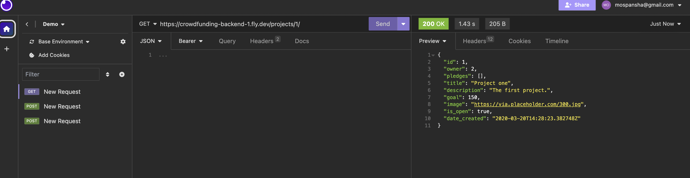

- [ ] A link to the deployed project. (https://crowdfunding-backend-1.fly.dev/projects/)

- [ ] A screenshot of Insomnia, demonstrating a successful GET method for anyendpoint.
  

- [ ] A screenshot of Insomnia, demonstrating a successful POST method for anyendpoint.
  

- [ ] A screenshot of Insomnia, demonstrating a token being returned.

- [ ] Step by step instructions for how to register a new user and create a newproject (i.e. endpoints and body data).

New User creation 
1. Method: POST
2. URL: (https://crowdfunding-backend-1.fly.dev/users/)
3. Body (JSON)
4. {
  "username": "example_user",
  "email": "user@example.com",
  "password": "your_password"
}

New Project creation
1. Method: POST
2. URL: (https://crowdfunding-backend-1.fly.dev/projects/)
3. Body (JSON)
4. {"title":"Project one",
 "description":"The first project.",
 "goal":150,
 "image":"https://via.placeholder.com/300.jpg",
 "is_open":true,
 "date_created":"2020-03-20T14:28:23.382748Z",
 "owner":"Real Creator”}

- [ ] Your refined API specification and Database Schema.

